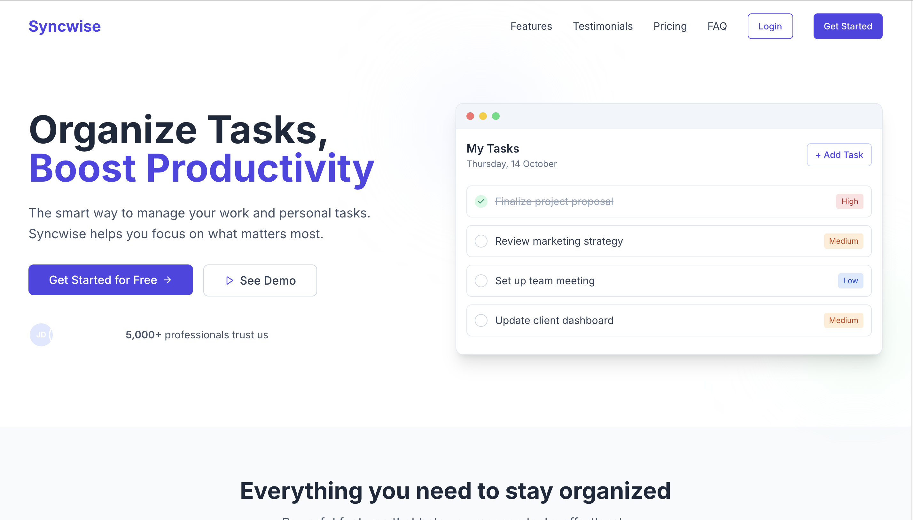

# 🚀 SyncWise - Modern Task Management App

**Live Demo:** [https://syncwise.vercel.app/](https://syncwise.vercel.app/)



## ✨ Features
- **Drag-and-Drop Interface**
- **Real-Time Sync**
- **Progress Analytics**
- **Due Date Reminders**
- **Dark/Light Mode**

## 🛠 Tech Stack
- **Frontend:** Next.js, TypeScript, Tailwind CSS, shadcn/ui
- **State Management:** Zustand
- **Backend:** Appwrite
- **Database:** Vercel Postgres
- **Deployment:** Vercel

## 🚀 Getting Started

### Prerequisites
- Node.js v18+
- npm v9+
- Git

### Installation

1. **Clone the repository**
```sh
git clone https://github.com/your-username/syncwise.git
cd syncwise
```
2. **Install dependencies**
```sh
npm install
# or
yarn install
# or
pnpm install
```
3. **Set up environment variables**
```sh
cp .env.example .env.local
```
4. **Run the development server**
```sh
npm run dev
# or
yarn dev
# or
pnpm dev
```
# Building for Production
```sh
npm run build
# or
yarn build
# or
pnpm build
```
# Running Tests
```sh
npm test
# or
yarn test
# or
pnpm test
```
# 📦 Deployment
```sh
vercel
# or
vercel --prod
```
# 🤝 Contributing
- 1. **Fork the project**
- 2. **Create your feature branch**
```sh
git checkout -b feature/amazing-feature
```
- 3. **Commit Your changes**
```sh
git commit -m 'Add some amazing feature'
```
- 4. **Push to the branch**
```sh
git push origin feature/amazing-feature
```
- 5. **Open a Pull Request**

# Contact
- **Baru Charita Sri**
- **charitasrichowdary@gmail.com**